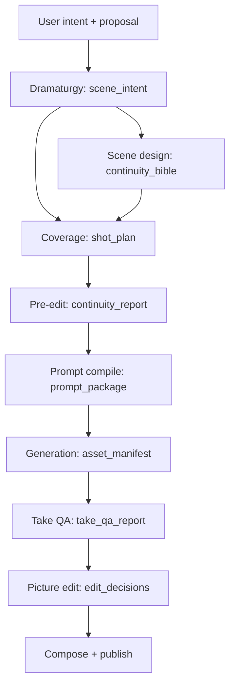

# Narrative Movie Production Architecture

Status: foundational beta (`narrative-movie` v0.1)

This extension evolves OpenMontage toward an agentic filmmaking system that can
explain why a scene exists, design coverage that cuts together, adapt stable shot
intent to changing video models, validate generated takes, and edit from the footage
that actually exists. It extends OpenMontage; it does not replace its generic
production capabilities.

## Architectural fit

OpenMontage is already an agent-first production framework. YAML pipeline manifests
declare stages, tools, artifacts, review criteria, approvals, and budgets. Markdown
director skills supply stage-specific judgment. JSON Schema artifacts and checkpoints
form the persistent handoffs. The ComfyUI adapter, asset manifests, provenance,
Remotion, HyperFrames, and FFmpeg provide execution infrastructure.

The production `cinematic` pipeline is optimized for trailers, teasers, and
mood-driven edits. Its standard `scene_plan` is intentionally broad and has no
separate coverage, continuity, prompt-compilation, or take-QA contracts. Changing it
would risk existing users and create avoidable upstream conflicts. Narrative work is
therefore introduced as a separate beta profile that reuses the same framework.

## Responsibility boundaries

| Owner | Responsibility | Must not own |
|---|---|---|
| OpenMontage | Orchestration, manifests, stage state, ComfyUI execution, assets, rendering, provenance, and approval gates | A duplicated encyclopedia of every filmmaking discipline |
| `screenwriting-skills-en-optimized` | Premise, theme, objectives, conflict, scene purpose, beats, dialogue, subtext, setup/payoff | Camera design or generation prompts |
| Selected `generative-media-skills` | Cinematography, performance, production design, continuity craft, previsualization, media QA, broad editing craft | Pipeline orchestration or workflow node syntax |
| Prompt dialect compilers | Model-appropriate wording for H3 and WAN 3 before an opaque ComfyUI workflow | Workflow execution or the stable creative source of truth |
| Future `cinematic-editing-skills` | Deep narrative picture-editing knowledge if needed | Pre-generation continuity approval |

External knowledge is selected per stage. It is not copied wholesale into
`.agents/skills`, and prose from one stage is not accumulated into a monolithic
prompt.

## Stage and artifact flow

The canonical provider-independent planning artifacts are:

- `scene_intent`: what happens and why—purpose, characters, objectives, stakes,
  emotional progression, beats, information, dialogue, subtext, and key actions.
- `continuity_bible`: global identity, wardrobe, props, environment, time/light, and
  spatial geography.
- `shot_plan`: coverage strategy and ordered provider-independent shot intent.
  Every shot carries entrance and exit continuity state, edit handles, and dramatic
  beat references. Every adjacent pair has an explicit edit boundary.

Derived artifacts are:

- `continuity_report`: advisory pre-generation review of conventional continuity,
  coverage, risks, intentional exceptions, and repairs.
- `prompt_package`: prompt-dialect compilation of every approved shot plus its
  ComfyUI workflow contract, exposed inputs, output node, and reference bindings.
- `take_qa_report`: observations and usable ranges for actual generated takes.

`lib/narrative_contracts.py` validates cross-artifact identifiers and completeness.
It intentionally does not make creative decisions; those remain with the active
stage skill and reviewer.

## Continuity and edit-boundary model

Continuity operates at two levels:

1. Global continuity lives in `continuity_bible`: stable character identity,
   wardrobe, props, environment, time/light, and established geography.
2. Sequential continuity lives on each shot: position, body orientation, eyeline,
   movement direction, current action, prop state, emotional state, and camera-side
   relationship at entrance and exit.

Each adjacent shot pair has an edit boundary describing the outgoing and incoming
action, cut point, movement vector, spatial relation, screen direction, visual/audio
bridge, match-on-action need, required handles, and insert/cutaway fallback. This
lets coverage be repaired before expensive generation.

The continuity reviewer assesses the 180-degree rule, eyelines, screen direction,
entrances/exits, action overlap, match on action, the 30-degree rule, shot-size and
composition change, spatial geography, and coverage. A convention is never an
absolute prohibition. Each finding records status (`pass`, `risk`, `violation`, or
`intentional_exception`), reasons, impact, and a repair strategy. An intentional axis
crossing can pass when motivated and supported by an axis-reset shot.

## Prompt compilation

The shot plan remains the creative source of truth. The Prompt Compiler reads an
approved `shot_plan` and `continuity_report`, then emits one dialect-specific entry per
shot. A compiler may change wording, parameter names, reference labels, duration
limits, negative syntax, or failure-mitigation strategy; it may not silently change
blocking, lens intent, axis side, performance, narrative purpose, or shot order.

Narrative video execution has one boundary: an opaque, premade ComfyUI API workflow.
The deterministic compiler module supports MiniMax H3 and WAN 3 prompt dialects but
does not select or call whatever model/service is inside the graph. A small workflow
contract declares only existing node inputs and the video output node. The compiler
preserves structured exact dialogue, continuity state, and edit-boundary needs while
binding only those declared inputs. The dry-run gate reviews this complete handoff
without queuing a ComfyUI job. See `docs/NARRATIVE_PROMPT_COMPILERS.md`.

## External repository assessment

### Screenwriting skills

`nakedfighter3d/screenwriting-skills-en-optimized` is available and validated at
commit `0c641f19a9d4e97d4438ff763d89c35772a2dce6`. OpenMontage pins that revision and
installs only `sw-workflow`, `sw-premise-theme`, `sw-story-structure`,
`sw-character-conflict`, `sw-scene-craft`, and `sw-dialogue` into the local
`.agents/skills/` directory. `sw-workflow` runs in subordinate mode and the
dramaturgy director maps its selected outputs into `scene_intent`; no theory is
copied into OpenMontage prompts.

The installed directories and `skills-lock.json` remain untracked. This is a
deliberate licensing boundary: the upstream-derived package preserves the notice
“For personal study use” and does not claim a broader redistribution grant. Run
`scripts/install_screenwriting_skills.py --acknowledge-study-use` outside a
production run, then use `--check` before the dramaturgy stage. The lock records the
source, exact revision, selected skills, license notice, and content digests.

To update the dramaturgy package, validate the new revision in its own repository
first. Then change the pinned revision in both `external-skills.yaml` and the
installer, reinstall the selective subset with `--force`, inspect the six skill
diffs, and rerun the Narrative Movie contract suite. Never track the installed
copies or `skills-lock.json` in OpenMontage.

### Generative media skills

The recommended selective set is:

- `cinematic-shot-direction`
- `performance-direction`
- `lighting-direction`
- `production-design-direction`
- `storyboard-previsualization`
- `asset-continuity-management`
- `generated-media-qa`
- `editing-montage`

Load only the skills relevant to the current stage. `editing-montage` is a useful
broad base, but it does not fully cover the planned depth of narrative picture
editing. Keep the seam for a future standalone `cinematic-editing-skills` package;
do not create that large theory repository during this foundation.

### Video prompting skills

`Square-Zero-Labs/video-prompting-skill` is best treated as research, not a broad
runtime dependency beside OpenMontage's existing model leaf skills. Its Seedance 2.5
material is a useful cross-check, and its MiniMax H3 treatment is materially deeper
than OpenMontage's current H3 skill. Selectively adapt verified H3 reference modes,
labels, retention, and performance-transfer guidance. Its WAN material is centered
on Wan 2.2 and is not sufficient authority for the WAN 3 prompt dialect.

### Architectural references

- `director-skills`: adopt separation of creative intent, cinematic execution,
  prompt adaptation, and generation-failure diagnosis. Do not vendor the package.
- Oberon: adopt global versus sequential continuity, entrance/exit shot memory,
  take-level QA, and later EDL concepts. Do not adopt simplistic deterministic
  screen-direction heuristics.
- `create-storyboard-skill`: adopt receiver-in/handoff-out, motion vectors, spatial,
  visual, and audio bridges, edit handles, and fallback inserts. Keep provider clip
  limits out of the universal shot representation.

## First vertical slice

`examples/narrative-dialogue-dry-run/` contains **The Last Bus**, a four-shot diner
conversation. It demonstrates scene purpose and beats, a two-character axis and
eyelines, a global continuity bible, shot/reverse-shot coverage, sequential state,
three edit boundaries, continuity findings, and H3/WAN 3 ComfyUI prompt compilation.
It intentionally records zero generation calls and zero cost.

## Implemented now

- Separate beta `narrative-movie` manifest with explicit planning/execution approvals.
- Eleven stage-director skills, including distinct continuity, prompt compilation,
  generated-take QA, and picture-editing stages.
- Six JSON Schema artifact types and checkpoint artifact routing.
- Deterministic cross-artifact validation for the planning bundle and take selection.
- Deterministic MiniMax H3 and WAN 3 prompt dialects over opaque ComfyUI workflow
  contracts, a dry-run CLI, and dialogue/duration/reference validation.
- Selective external-skill dependency policy.
- A schema-valid, no-cost dialogue-scene dry run and contract tests.

## Intentionally deferred

- Live ComfyUI video generation and automated regeneration loops.
- Vision-model take scoring beyond the take-QA interface and existing analysis tools.
- Additional prompt dialects and registration of the user's real local workflows.
- Deep narrative picture-editing skill package and automatic EDL generation.
- Aggressive pruning or hiding of generic OpenMontage workflows.

## Compatibility and extension policy

The change surface is additive: one pipeline, one skill directory, six schemas, one
small cross-artifact validator, checkpoint mappings, tests, examples, and docs. The
production `cinematic` manifest, generic tool registry, provider interfaces, and
composition engines remain unchanged. Keep `calesthio/OpenMontage` as `upstream` and
follow `docs/UPSTREAM_SYNC.md` for updates.

The next milestone should register the user's real H3 and WAN 3 API-format workflows,
bind their exact exposed inputs and output nodes, then run one approved shot through
ComfyUI. Frame/vision QA should prove a rejected take can produce a targeted prompt
revision without mutating provider-independent shot intent.
